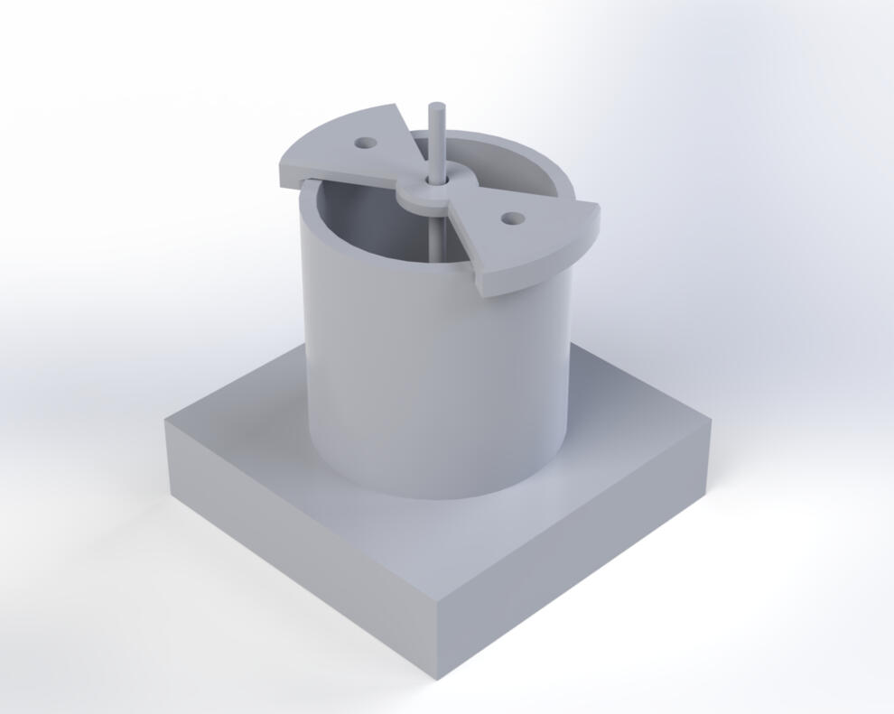

# Projects

  

  

    01
    <h3 class="project-title">Custom Beyerdynamic Headphone Suspension System</h3>
    +
  

  

    
I identified a significant ergonomic deficiency in my Beyerdynamic headphones during extended use. While a suspension strap solution existed from Capra Audio, the mounting geometry was fundamentally incompatible with my hardware. This required a redesign that could integrate a custom tension-fit strap into an existing mechanical assembly without compromising the structural integrity of the headband.
    

    

      
Concept Sketch

      
      
3D CAD RENDER (SolidWorks)

      
    

    

    
DEMO

      <video src="assets/TENG Project.mp4" muted playsinline loop preload="metadata" class="project-video teng-video" aria-label="Project demo"></video>
    

    

      AutoCAD
    

    

      <button class="project-close-button" aria-label="Close project">−</button>
    

  

  

    02
    <h3 class="project-title">Triboelectric Nanogenerator</h3>
    +
  

  

    
Designed and developed a triboelectric nanogenerator to convert mechanical motion into electrical energy through optimized structural design. Modeled and fabricated custom TENG components using SolidWorks and 3D printing, iterating on geometry and material interfaces to improve durability and performance. Structural optimizations resulted in a 25% increase in voltage output, demonstrating the impact of design-driven efficiency improvements in energy harvesting systems.

    

      
Concept Sketch

      
      
3D CAD RENDER (SolidWorks)

      
    

    

    
DEMO

      <video src="assets/TENG Project.mp4" muted playsinline loop preload="metadata" class="project-video teng-video" aria-label="Project demo"></video>
    

    

      AutoCAD
    

    

      <button class="project-close-button" aria-label="Close project">−</button>
    

  

  

    03
    <h3 class="project-title">Streamlit Curve Fitting Application</h3>
    +
  

  

    
The Interactive Curve Fitting Application is a Python-based tool developed using the Streamlit framework. It allows users to explore and analyze datasets by fitting them to various mathematical models and evaluating their accuracy using statistical metrics. The application is user-friendly, making it ideal for students, researchers, and professionals working with data analysis and predictive modeling.

    

      
DEMO

      <video src="assets/Curve-Fitting-Application-Project.mp4" muted playsinline loop preload="metadata" class="project-video" aria-label="Project demo"></video>
    

    

      Python
    

    

      <a href="https://github.com/SabeehDanish/Steamlit-Interactive-Curve-Fitting-Application" target="_blank" rel="noopener noreferrer" class="project-link-button" aria-label="View Streamlit Curve Fitting Application on GitHub">
        <svg class="github-icon" viewBox="0 0 24 24" fill="none" stroke="currentColor" stroke-width="2" stroke-linecap="round" stroke-linejoin="round">
          <path d="M9 19c-5 1.5-5-2.5-7-3m14 6v-3.87a3.37 3.37 0 0 0-.94-2.61c3.14-.35 6.44-1.54 6.44-7A5.44 5.44 0 0 0 20 4.77 5.07 5.07 0 0 0 19.91 1S18.73.65 16 2.48a13.38 13.38 0 0 0-7 0C6.27.65 5.09 1 5.09 1A5.07 5.07 0 0 0 5 4.77a5.44 5.44 0 0 0-1.5 3.78c0 5.42 3.3 6.61 6.44 7A3.37 3.37 0 0 0 9 18.13V22"></path>
        </svg>
        View on GitHub
      </a>
    

    

      <button class="project-close-button" aria-label="Close project">−</button>
    

  

